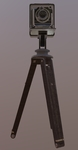

# Antique Camera

## Tags

[core](../../Models-core.md), [testing](../../Models-testing.md), [issues](../../Models-issues.md)

## Summary

Static model of old camera on a tripod. [Issues: non-Khronos mark]

## Operations

* [Display](https://github.khronos.org/glTF-Sample-Viewer-Release/?model=https://raw.GithubUserContent.com/KhronosGroup/glTF-Sample-Assets/main/./Models/AntiqueCamera/glTF-Binary/AntiqueCamera.glb) in SampleViewer
* [Download GLB](https://raw.GithubUserContent.com/KhronosGroup/glTF-Sample-Assets/main/./Models/AntiqueCamera/glTF-Binary/AntiqueCamera.glb)
* [Model Directory](./)

## Screenshot

## Description

Static model of old camera on a tripod, with UX3D logo on one of the legs.

## Legal

&copy; 2018, UX3D. [CC0 1.0 Universal](https://creativecommons.org/publicdomain/zero/1.0/legalcode)

 - Maximillan Kamps for Everything

&copy; 2017, UX3D. [UX3D Trademark or Logo]()

 - Non-copyrightable logo for UX3D logo

#### Assembled by modelmetadata