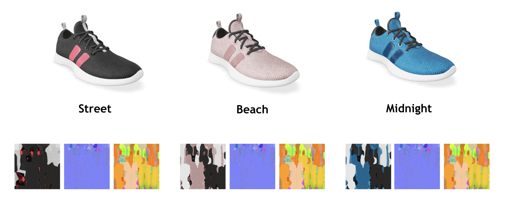

# Materials Variants Shoe

## Tags

[extension](../../Models-extension.md), [showcase](../../Models-showcase.md), [written](../../Models-written.md)

## Summary

A model of a shoe that illustrates use of the KHR_materials_variants extension with three materials included in the asset.

## Operations

* [Display](https://github.khronos.org/glTF-Sample-Viewer-Release/?model=https://raw.GithubUserContent.com/KhronosGroup/glTF-Sample-Assets/main/./Models/MaterialsVariantsShoe/glTF-Binary/MaterialsVariantsShoe.glb) in SampleViewer
* [Download GLB](https://raw.GithubUserContent.com/KhronosGroup/glTF-Sample-Assets/main/./Models/MaterialsVariantsShoe/glTF-Binary/MaterialsVariantsShoe.glb)
* [Model Directory](./)

## Screenshot

## Description

This model uses the KHR_materials_variants extension. It is a shoe with 3 color variants in it: "Beach", "Midnight", and "Street".

If each variant was a separate model, they would be 5.4 MB each. Combined they make up a single model that is 7.8MB since they share geometry and all textures except the base color texture.

## Legal

&copy; 2021, Shopify. [CC BY 4.0 International](https://creativecommons.org/licenses/by/4.0/legalcode)

 - Shopify for Everthing

#### Assembled by modelmetadata