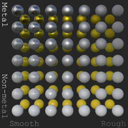

# Metal-Rough Spheres (textureless)

## Tags

[core](../../Models-core.md), [testing](../../Models-testing.md)

## Summary

Tests various metal and roughness values (textureless).

## Operations

* [Display](https://github.khronos.org/glTF-Sample-Viewer-Release/?model=https://raw.GithubUserContent.com/KhronosGroup/glTF-Sample-Assets/main/./Models/MetalRoughSpheresNoTextures/glTF-Binary/MetalRoughSpheresNoTextures.glb) in SampleViewer
* [Download GLB](https://raw.GithubUserContent.com/KhronosGroup/glTF-Sample-Assets/main/./Models/MetalRoughSpheresNoTextures/glTF-Binary/MetalRoughSpheresNoTextures.glb)
* [Model Directory](./)

## Screenshot

## Description

_None provided._

## Legal

&copy; 2019, Public. [CC0 1.0 Universal](https://creativecommons.org/publicdomain/zero/1.0/legalcode)

 - Krill Gavrilov for Everything

&copy; 2019, Public. [CC0 1.0 Universal](https://creativecommons.org/publicdomain/zero/1.0/legalcode)

 - CAD Model generated by Draw Harness script using Open CASCADE Technology for Everything

#### Assembled by modelmetadata