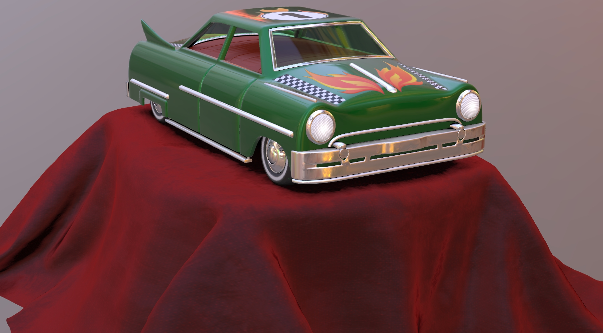

## Screenshot

Above: Screenshot using Camera002 in [Babylon.js Sandbox](https://sandbox.babylonjs.com/).

## Description

This model demonstrates the usage of [KHR_materials_sheen](https://github.com/KhronosGroup/glTF/blob/master/extensions/2.0/Khronos/KHR_materials_sheen/README.md), [KHR_materials_transmission](https://github.com/KhronosGroup/glTF/blob/master/extensions/2.0/Khronos/KHR_materials_transmission/README.md) and [KHR_materials_clearcoat](https://github.com/KhronosGroup/glTF/blob/master/extensions/2.0/Khronos/KHR_materials_clearcoat/README.md).

This model also includes eight sample cameras, featuring different angles on the car and its materials.  In software packages that represent camera locations with 3D markers, it may be beneficial to reduce the size of these markers, as marker size is not specified in glTF.

