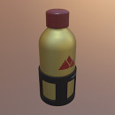

# Water Bottle

## Tags

[core](../../Models-core.md), [testing](../../Models-testing.md), [written](../../Models-written.md)

## Summary

Basic metal/roughness water bottle.

## Operations

* [Display](https://github.khronos.org/glTF-Sample-Viewer-Release/?model=https://raw.GithubUserContent.com/KhronosGroup/glTF-Sample-Assets/main/./Models/WaterBottle/glTF-Binary/WaterBottle.glb) in SampleViewer
* [Download GLB](https://raw.GithubUserContent.com/KhronosGroup/glTF-Sample-Assets/main/./Models/WaterBottle/glTF-Binary/WaterBottle.glb)
* [Model Directory](./)

## Screenshot

## Description

A basic PBR model with Normal, Occlusion, and Emissive maps

## Legal

&copy; 2017, Public. [CC0 1.0 Universal](https://creativecommons.org/publicdomain/zero/1.0/legalcode)

 - Microsoft for Everything

#### Assembled by modelmetadata